<h1 align="center">k85 wallpaper tool</h1>
<p align="center">
   <br>
</p>

<p align="center">
   <a href="#Installation">[Installation]</a>&ensp;&ensp;
   <a href="#Animated-wallpapers">[Animated wallpapers]</a>
</p>

If you ever wanted to set a wallpaper that would span across multiple monitors, you probably know how hard it is to make it look seamless. That's where this tool comes in handy. After a quick and easy setup, it calculates the differences in display sizes and the gaps between them, allowing you to set a perfectly aligned wallpaper.


| Before                                              | After                                             |
| ----------------------------------------------------- | --------------------------------------------------- |
| 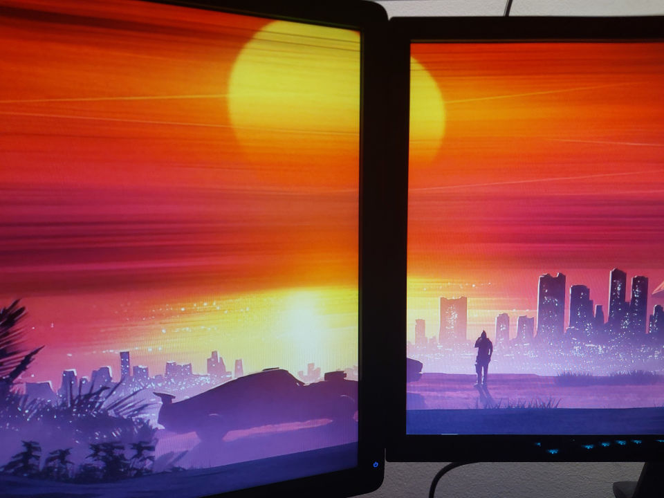 | 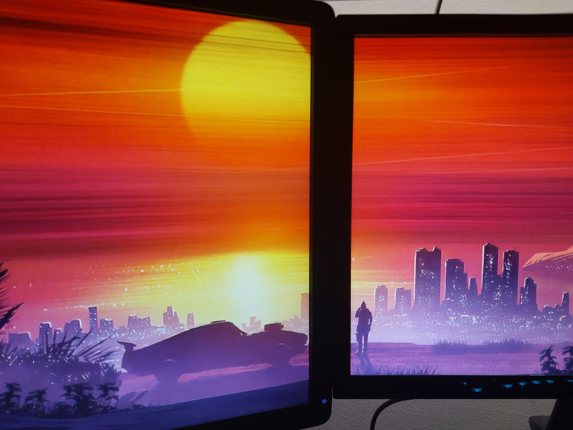 |

The setup works by displaying lines that the user manually aligns. This only needs to be done once, as the configuration is saved for future use.

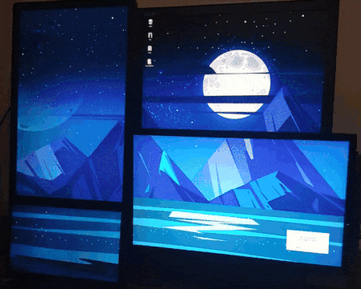
<br>


| Before                                              | After                                             |
| ----------------------------------------------------- | --------------------------------------------------- |
| 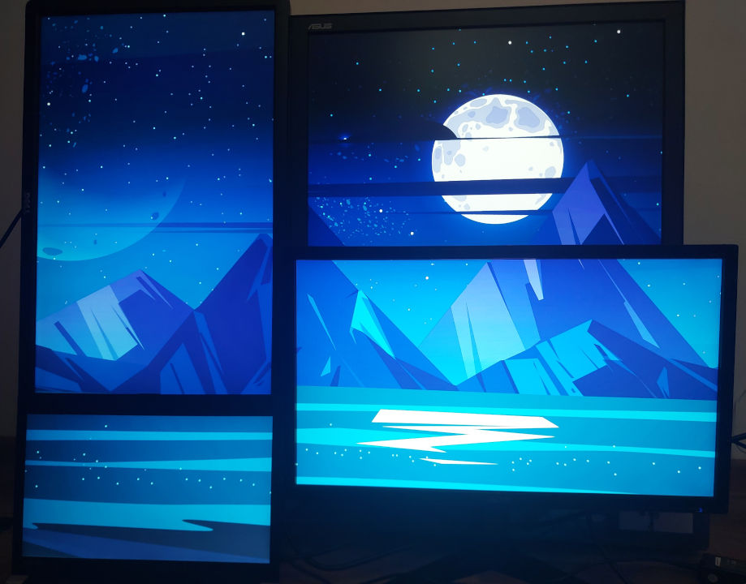 | 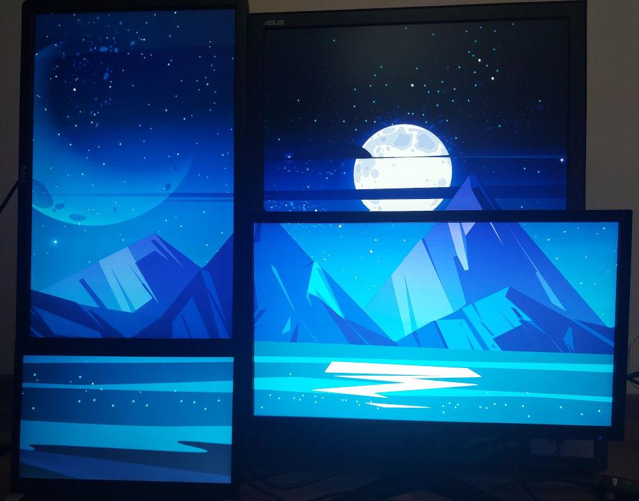 |
| 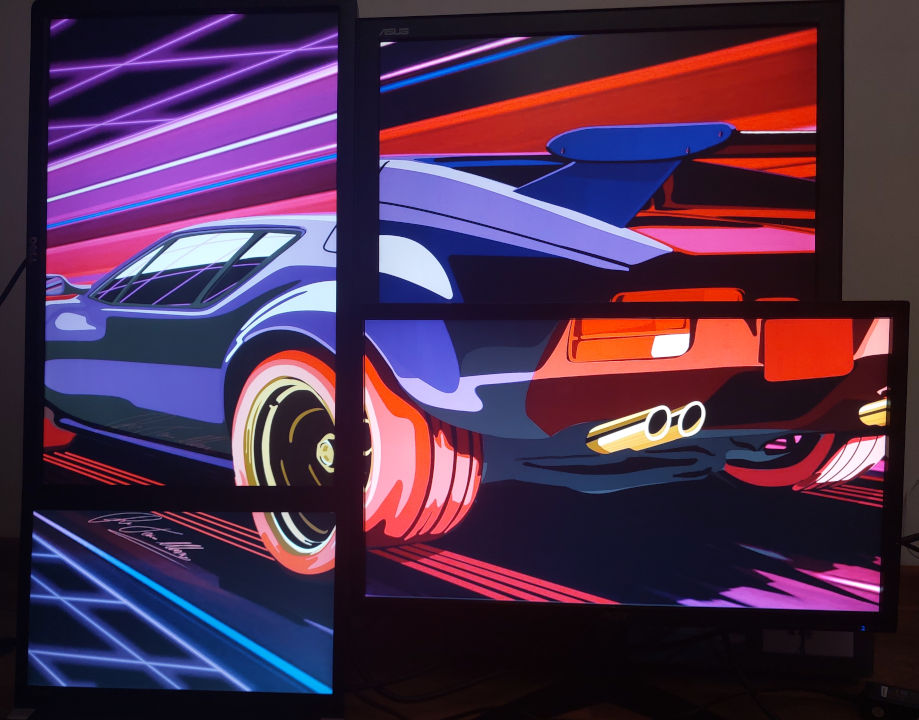 | 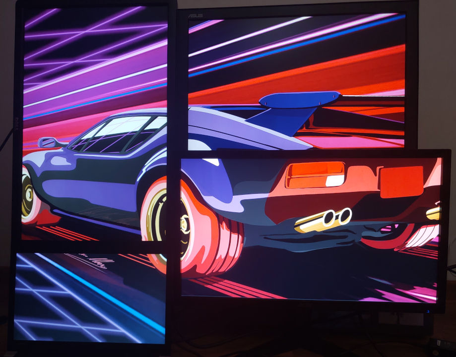 |
| 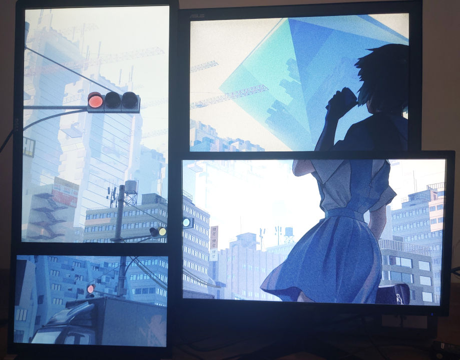 | 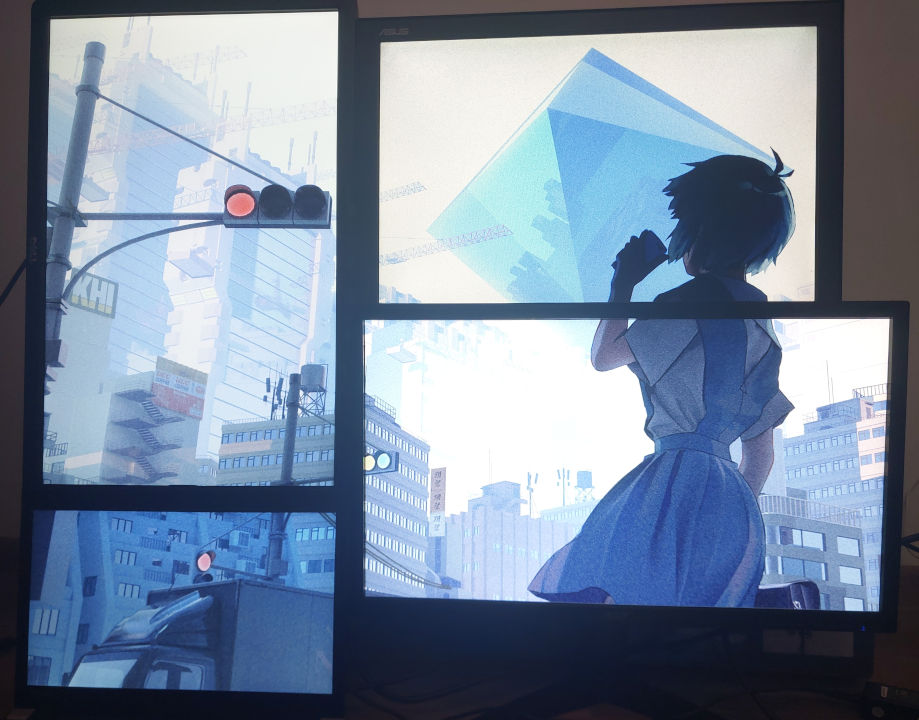 |


| wallpaper                                                                                              | artist                                                           |
| -------------------------------------------------------------------------------------------------------- | ------------------------------------------------------------------ |
| [image1](https://www.reddit.com/media?url=https%3A%2F%2Fi.redd.it%2Fg9mkm42rvu0b1.jpg)                 | [kvacm](https://www.instagram.com/kvacm)                         |
| [image2](https://www.freepik.com/free-vector/night-ocean-landscape-full-moon-stars-shine_17740155.htm) | [BGMotion_Utube](https://www.youtube.com/@BGMotion_Utube/videos) |
| [image3](https://www.behance.net/gallery/48555649/80s-Pantera)                                         | [DTM_Illustration](https://www.behance.net/deto)                 |
| [image4](https://www.pixiv.net/en/artworks/84466005)                                                   | [KRYP_132](https://www.pixiv.net/en/users/16096005)              |

Compatible with:

* Windows 10 / 11
* Linux Gnome / Cinnamon / Mate

on other enviroments you're gonna have to manually set wallpaper mode to "spanned" and use the created .png file

## Installation

<details open>
<summary>Windows</summary>

#### Option 1: .exe file

1. go to the [Releases](https://github.com/kisielo85/k85-wallpaper-tool/releases) page
2. download and run the latest .exe file

#### Option 2: running with python

1. Install [Python](https://www.python.org/downloads/)
2. Download and unpack [.zip repository](https://github.com/kisielo85/k85-wallpaper-tool/archive/refs/heads/main.zip) or use `git clone`
   ```cmd
   git clone https://github.com/kisielo85/k85-wallpaper-tool
   cd k85-wallpaper-tool
   ```
3. Create virtual enviroment (optional)
   ```cmd
   py -m venv venv
   venv\Scripts\activate
   ```
4. Install requirements
   ```cmd
   pip install -r requirements.txt
   ```
5. Run script
   ```cmd
   py main.py
   ```

</details>

<details>
<summary>Linux</summary>

#### Option 1: executable file

1. go to the [Releases](https://github.com/kisielo85/k85-wallpaper-tool/releases) page
2. download the latest linux release
3. grant executable permissions
   ```bash
   chmod +x ./k85.wallpaper.tool.linux.vX.XX
   ```
4. run it via GUI, or terminal
   ```bash
   ./k85.wallpaper.tool.linux.vX.XX
   ```


#### Option 2: running with python

1. Install dependencies
   ```bash
   sudo apt update
   apt install zenity python3 python3-pip python3-venv python3-tk
   ```
2. Download and unpack [.zip repository](https://github.com/kisielo85/k85-wallpaper-tool/archive/refs/heads/main.zip) or use `git clone`
   ```bash
   git clone https://github.com/kisielo85/k85-wallpaper-tool
   cd k85-wallpaper-tool
   ```
3. Create virtual enviroment
   ```bash
   python3 -m venv venv
   source venv/bin/activate
   ```
4. Install requirements
   ```bash
   pip install -r requirements.txt
   ```
5. Run script
   ```bash
   python3 main.py
   ```

</details>

## Animated wallpapers

.mp4 files can be converted the same way as images, but to use them you're gonna need [Wallpaper Engine](https://www.wallpaperengine.io) or something similar.

1. First - make sure you have [ffmpeg](https://ffmpeg.org/) installed.<br>
The quickest way to set it up is via command line
   * Windows:
      ```cmd
      winget install ffmpeg
      ```

   * Linux:
      ```bash
      sudo apt install ffmpeg
      ```

2. Make sure to select a wallpaper that's marked as "Video"
   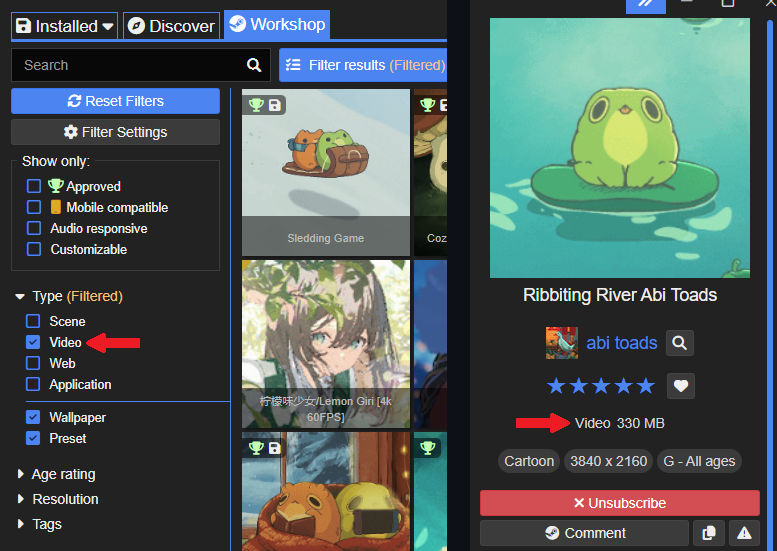
   <br>

3. Find the .mp4 file and open it in k85-wallpaper-tool
   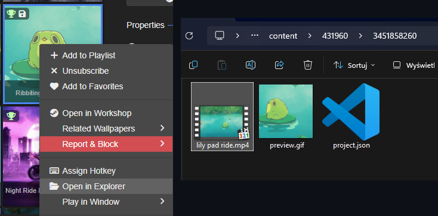
   <br>

4. After conversion a new file will be created, drag and drop it back into Wallpaper Engine
   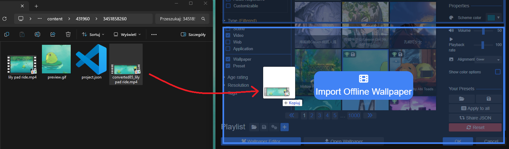
   <br>

5. Set the display mode to "stretch"
   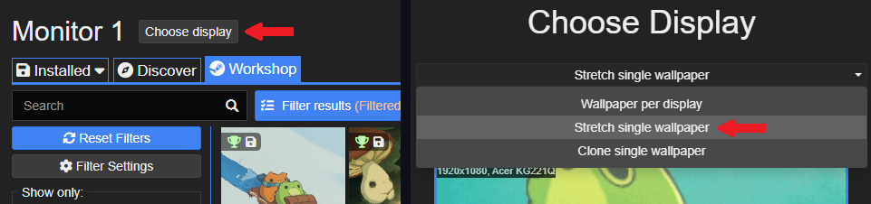